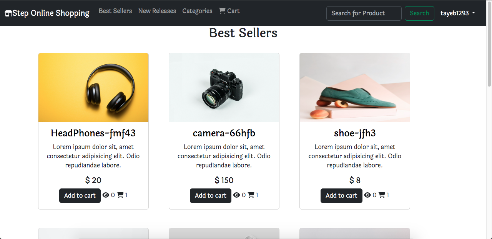

This website is an online store for selling products of various kinds.

Website Sections:

Firstly: Operations available to the administrator:

1- Add a product

2- Delete a product

3- Modify a product

4- Add a product category

5- Delete a product category

6- Modify a product category

7- Add a user

9- View sales invoices and download them as PDF files

10- Add purchase invoices, display them, and download them as PDF files

Secondly: Operations available to regular users (customers):

1- Browse products

2- Add products to the cart

3- Save the sales invoice and complete the payment electronically through the payment gateway (Moyasar)

You can watch the explanatory video of the website from the following link.

https://youtu.be/A_lohsaMfB4?si=uWzHTMBkIHIbp22C

<h4>  ·  <a href="https://github.com/abuomersd/E-commerce Website/blob/master/README.md"> Documentation </a>  ·  <a href="https://github.com/abuomersd/E-commerce Website/issues"> Report Bug </a>  ·  <a href="https://github.com/abuomersd/E-commerce Website/issues"> Request Feature </a> </h4>

## :star2: About the Project